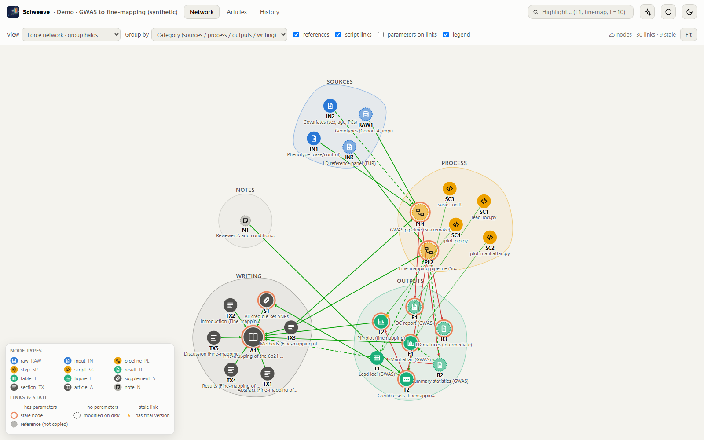
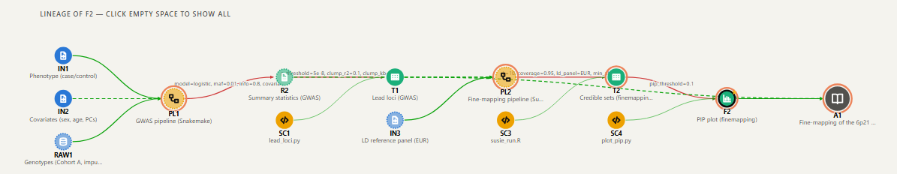
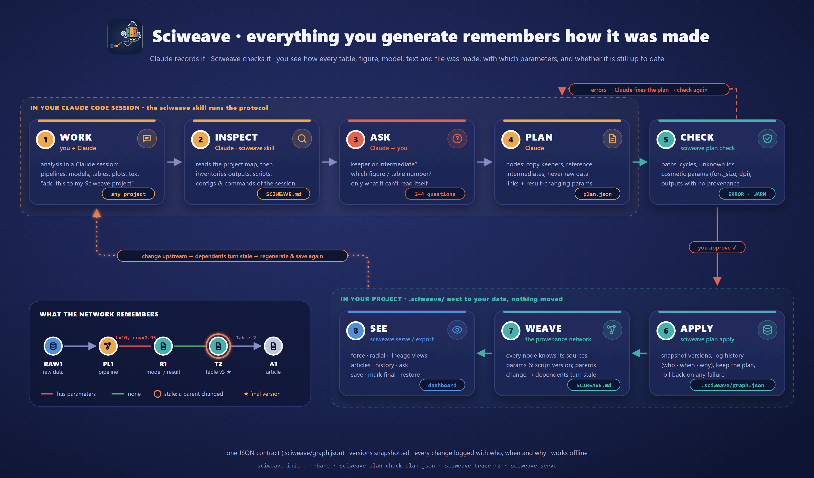
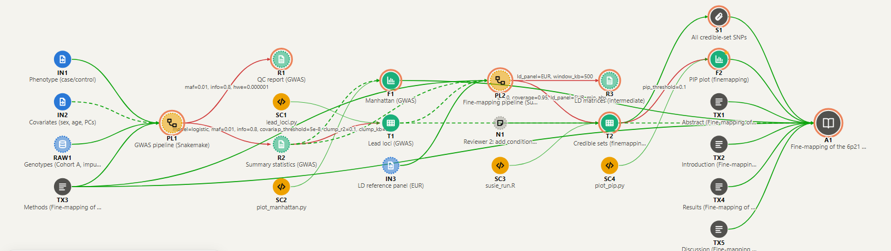
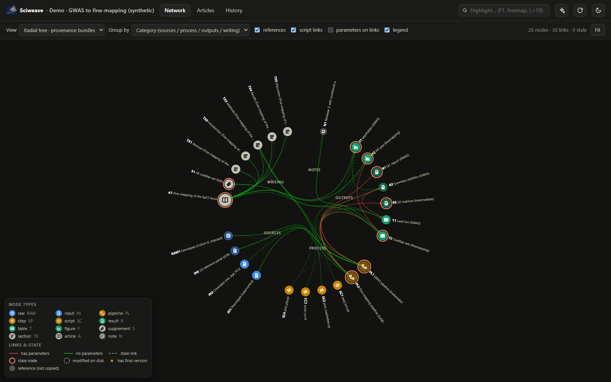
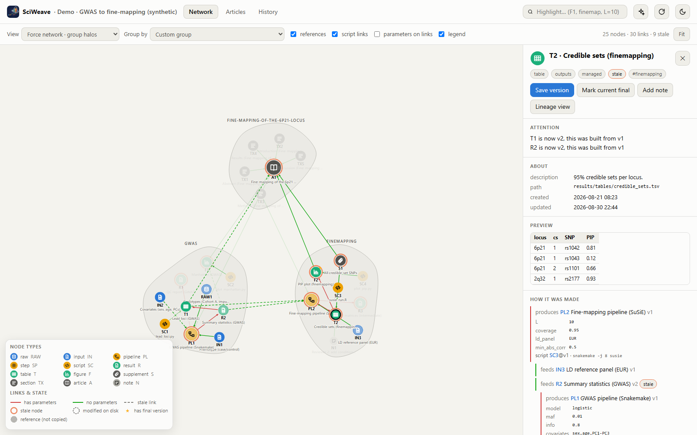
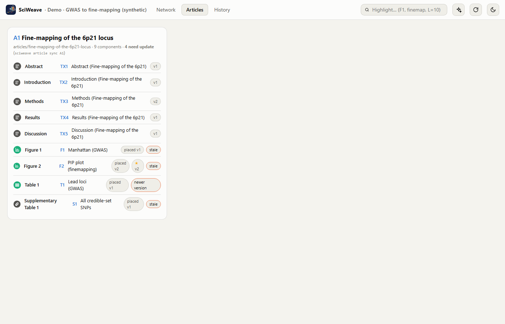
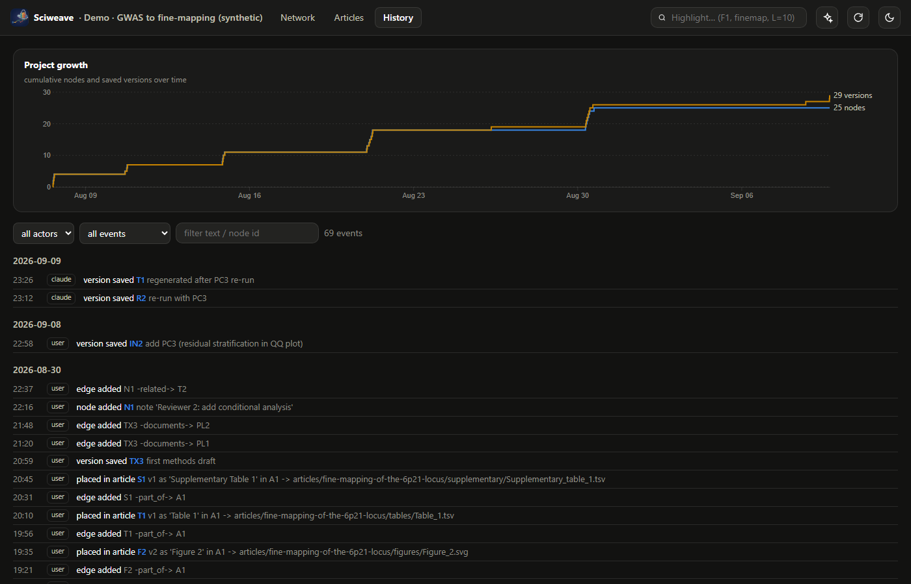

<div align="center">


# SciWeave

### Everything you generate remembers how it was made.

**Tables, figures, models, results, supplements, methods text: anything your analysis produces is woven
into one living provenance network with the raw data, pipelines, parameters and scripts behind it,
versioned, linked, and built to be driven by Claude.**

[](https://www.python.org)
[](pyproject.toml)
[](#-the-dashboard)
[](sciweave/skills/sciweave/SKILL.md)
[](LICENSE)

[Why](#-why) · [Quick start](#-quick-start) · [With Claude](#-with-claude) · [Dashboard](#-the-dashboard) · [Concepts](#-concepts) · [Commands](#-commands) · [Design](DESIGN.md)

<br>



<sub><i>The bundled demo (<code>sciweave demo</code>, synthetic data): GWAS → fine-mapping → article, grouped with halos.
Red links carry result-changing parameters, green links none; orange rings mark results made stale by an upstream change.</i></sub>

</div>

<br>

## 🔍 Why

A research project is a web, not a folder. A figure comes from a table, the table from a model,
the model from a pipeline run with particular thresholds, on inputs that were later updated, and
the methods text describes all of it. Months later nobody can answer:

> *Which script made this table? With which parameters? Which of the five `final_v3` files went
> into the submission? Is the model, and everything built on it, still valid now that the covariates changed?*

**SciWeave keeps the answer next to the result.** Every item knows its sources, the parameters
on each link, the script *version* that ran, and its own history. When anything upstream
changes, everything built from it turns **stale**, including tables, figures and text already placed in the article.

<table>
<tr>
<td width="33%" valign="top">

### 🕸️ A network, not a folder
Typed nodes with icons and short codes (`RAW1`, `PL2`, `T3`, `F2`, `SF7a`), linked by
**feeds / produces / derives / part_of**. See the whole project, or trace one result.

</td>
<td width="33%" valign="top">

### 🎛️ Parameters on the link
Only the ones that change results: thresholds, models, panels, windows. A **red** link has
parameters and a **green** one has none. Font sizes are flagged as cosmetic and left out.

</td>
<td width="33%" valign="top">

### ⏳ Versions & staleness
Managed files are snapshotted on every save. Old versions can be restored, one can be marked
**final**, and dependents go stale automatically.

</td>
</tr>
<tr>
<td valign="top">

### 📄 Article-aware
`article new` scaffolds figures/tables/supplementary/latex folders. Figures are *placed* from
their final version and stay linked to their source.

</td>
<td valign="top">

### 🤖 Claude-native protocol
Claude inspects your session, asks the few questions that matter, writes a `plan.json`, and
`plan check` validates it loudly before anything is applied.

</td>
<td valign="top">

### 🪶 Light & local
Python stdlib only, one JSON contract, D3 vendored inline. The dashboard works offline and can
be shared as a single HTML file.

</td>
</tr>
</table>

<br>

## 🧵 One result, fully traced

Select any node and the **lineage view** unrolls everything it was built from, left to right,
with the parameters written on the links:

<p align="center">
  
</p>

<sub>Phenotype, covariates and genotypes → GWAS pipeline (`model=logistic, maf=0.01, info=0.8`) → summary
statistics → lead loci (`p_threshold=5e-8, clump_r2=0.1`) → SuSiE fine-mapping (`L=10, coverage=0.95,
ld_panel=EUR`) → credible sets → PIP plot (`pip_threshold=0.1`) → the article.</sub>

<br>

## ⚡ Quick start

```bash
pip install sciweave              # core: no dependencies
pip install "sciweave[ai]"        # optional: Claude answers in the dashboard's Ask box
sciweave install-skill            # Claude Code skill -> ~/.claude/skills/sciweave

sciweave demo sciweave-demo       # a synthetic GWAS -> fine-mapping -> article project
cd sciweave-demo
sciweave status                   # 9 items stale after an upstream covariate change
sciweave trace F1                 # how the Manhattan plot was made
sciweave serve                    # dashboard at http://127.0.0.1:8765
```

Already have a project? Adopt it **in place**. Nothing is moved; SciWeave adds only `.sciweave/`
and a generated `SCIWEAVE.md` map:

```bash
cd my-existing-project
sciweave init . --bare --name "My GWAS"
```

<br>

## 🤖 With Claude

SciWeave is designed to be driven from a Claude Code session. You keep working as usual, and
when something is worth keeping:

> **You:** *We're done with the fine-mapping. Add the credible-sets table and the PIP plot to my
> SciWeave project; the plot is Figure 2.*

<p align="center">
  <a href="assets/flowchart/flowchart.svg"></a>
</p>

<sub>Generated by <code>assets/flowchart/flowchart.js</code> (pure Node → SVG → PNG via headless Chrome/Edge); <code>node assets/flowchart/flowchart.js</code> to rebuild.</sub>

- **Keepers are copied and versioned.** Pipeline intermediates are **referenced** where they live,
  and raw data is **never** copied.
- **Only result-changing parameters go on the links.** `plan check` warns about cosmetic ones
  (`font_size`, `dpi`) and about outputs whose provenance is unknown.
- **Nothing is applied without your OK.** Every applied plan is kept in `.sciweave/plans/`, and a
  failed apply rolls back.

The full protocol lives in [`SKILL.md`](sciweave/skills/sciweave/SKILL.md) and
[`protocol.md`](sciweave/skills/sciweave/protocol.md).

<br>

## 📊 The dashboard

`sciweave serve` opens a local dashboard. `sciweave export` writes the same thing as one
offline HTML file you can share.

<p align="center">
  
</p>
<p align="center"><sub><i>Whole-project lineage: sources on the left, the article on the right.</i></sub></p>

<table>
<tr>
<td width="50%"></td>
<td width="50%"></td>
</tr>
<tr>
<td align="center"><b>Radial tree</b>: groups as branches, provenance bundled through the hierarchy</td>
<td align="center"><b>Side panel</b>: preview, why it is stale, and how it was made, with every parameter</td>
</tr>
<tr>
<td width="50%"></td>
<td width="50%"></td>
</tr>
<tr>
<td align="center"><b>Articles</b>: every component with its placed, current and final version</td>
<td align="center"><b>History</b>: project growth and a filterable, per-actor timeline</td>
</tr>
</table>

- **Three views:** force network with halos · radial tree · lineage. **Group by** category, type,
  custom group, article or status.
- **Side panel:** preview (image, table head, text), how it was made (recursive, with
  parameters, script versions and commands), what uses it, versions (view, restore, mark final),
  notes and history. **Save version**, **Mark final** and **Add note** work live.
- **Search-as-you-type highlighting** (`F2`, `coloc`, `L=10`), and an **Ask** box answered
  locally or by Claude when `sciweave[ai]` is installed.
- Light and dark themes, auto-refresh, and deep links such as `?view=lineage#node=T3`.

<br>

## 🧩 Concepts

| Node | Code | | Node | Code | | Link | Meaning |
|---|---|---|---|---|---|---|---|
| raw data | `RAW` | | table | `T` | | `feeds` | input → process |
| input | `IN` | | figure | `F` | | `produces` | process → output *(params)* |
| pipeline | `PL` | | supplement | `S` | | `derives` | output → output *(params)* |
| step | `SP` | | section | `TX` | | `code` | script → what it built |
| script | `SC` | | article | `A` | | `part_of` | component → article |
| result | `R` | | note | `N` | | `documents` · `related` | informational |

**Staleness model.** Each saved version records the versions of its *effective parents*: its
direct sources plus, through pipelines and scripts, the inputs of the process that made it. If a
pipeline has three outputs and you regenerate one, the other two correctly stay stale. A cosmetic
re-render (`save --no-refresh`) doesn't clear staleness. Details are in [DESIGN.md](DESIGN.md).

<br>

## 🧰 Commands

| | |
|---|---|
| `init [--bare]` | create a project, or adopt an existing one in place |
| `add <type> "<label>" [path] [--copy\|--ref]` | add a node (copied + versioned, or referenced) |
| `link A B --rel produces -p L=10 --script SC1 --cmd "…"` | record provenance with parameters |
| `save <id> [-m msg] [--no-refresh] [--all]` | snapshot new versions; dependents go stale |
| `final <id>` · `restore <id> <v> [--out]` | mark final · bring back an old version |
| `trace <id> [--down]` · `show <id>` · `history [id]` | how it was made · what uses it · timeline |
| `status [--untracked]` | stale, modified, missing, untracked |
| `article new\|place\|sync\|show` | article folder, place figures/tables, refresh after updates |
| `plan template\|check\|apply` | the checked import protocol |
| `ask "…"` · `context` | question the project · compact dump for AI |
| `serve` · `export` · `watch [--autosave]` | dashboard · offline HTML · file watcher |

<br>

## 🗂️ What lives where

```
my-project/
├── .sciweave/          graph.json (single source of truth) · history.jsonl · objects/ (versions) · plans/
├── SCIWEAVE.md         generated map for humans and AI; never edited by hand
├── data/  pipelines/  scripts/  results/{tables,figures,supplementary}/
└── articles/<slug>/    figures · tables · supplementary · scripts · data · notes · latex/
```

Commit `.sciweave/` with your project; the graph and history are plain JSON and diff well.

<br>

## 🗺️ Roadmap

- [x] Provenance graph, versions, staleness, history, article templates
- [x] Claude skill + checked import protocol, adopting existing projects in place
- [x] Dashboard: force · radial · lineage, articles, history, ask, offline export
- [ ] Snakemake / Nextflow importers (DAG + config → steps and parameters automatically)
- [ ] Visual diffs between versions (images, tables)
- [ ] LaTeX hooks: `\sciweave{F2}` → figure path + provenance footnote
- [ ] MCP server so any assistant can query the graph

<br>

<div align="center">


**SciWeave**: keep the thread from raw data to every result you publish.

<sub>MIT © Alsamman M. Alsamman · Sister project of <a href="https://github.com/AlsammanAlsamman/brainny">brainny</a></sub>

</div>
